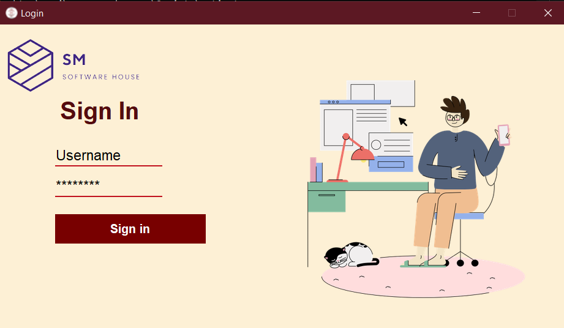
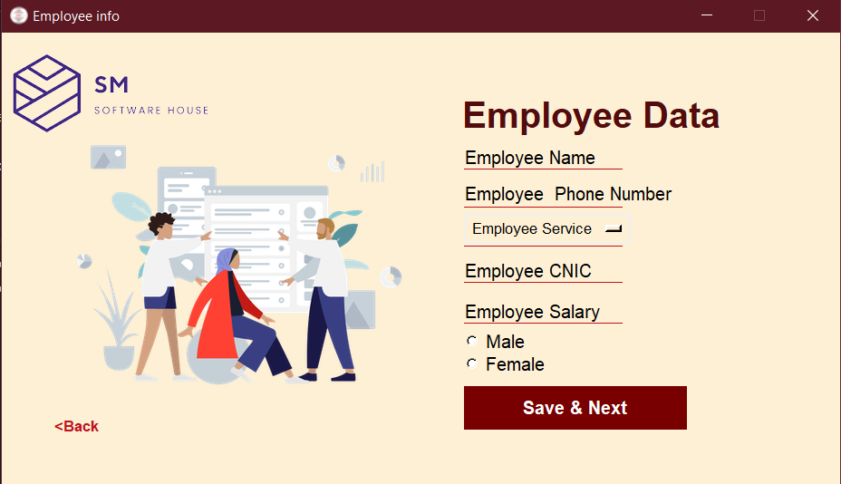
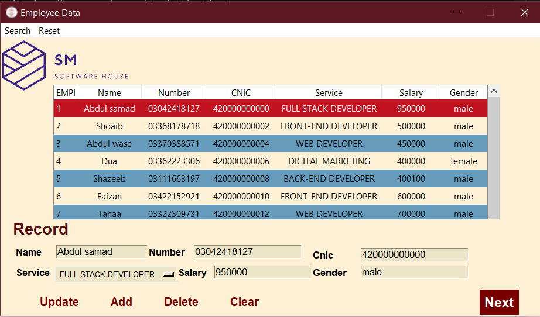
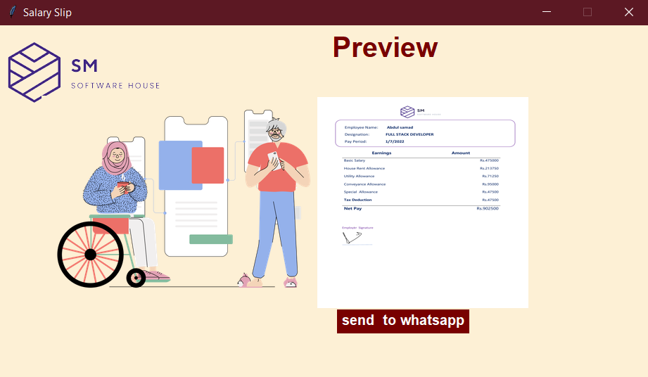

# Hi, I'm Abdul Samad! 👨🏼‍💻


# Salary Management

Salary Management is my second-semester project, led by myself. This project uses SQLite for the database and Tkinter(python) for GUI. Easy to use by any age group. Design in a way that only HR on the company can access it and have a right to add a new member or remove any member from the database. Selecting any employee name and pressing the NEXT button will redirect to the salary-slip page, The HR can directly send that slip to the employee's Whatsapp Number.

# Deployment
To run this program you need to run the following command in your cmd where the folder is located


## Environment Variables
```
py -m venv venv
```
```
venv\Scripts\activate
```

```
pip install -r requirements.txt 
```
then
```
python main.py
```

## FAQ

#### How to use⁇

Try not to open any word file in the background while using the Next button
and not use the mouse while sending slips to WhatsApp
the numbers already exist are dummy. Please enter a valid number to use.


## Features

- Light colors
- Simple font
- Database for storing data
- Whastapp the ```.png``` Salary Slip

<table border="0">
 <h1>Preview</h1>
        <tr>
            <td><b style="font-size:30px">Login Page</b></td>
            <td><b style="font-size:30px">Add new member</b></td>
         </tr>
<td>



</td>
    <td>


</td>
    </table>
<table border="0">
    <tr>
        <td><b style="font-size:30px">All employee data</b></td>
        <td><b style="font-size:30px">Salary Slip page</b></td>
     </tr>
     <tr>
<td>



</td>
    <td>


</td>
    </table>


